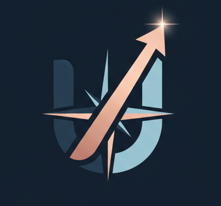

#  UniMatch

<p align="left">
  
  
  <a href="https://www.unimatch.pt/"></a>
</p>

**UniMatch** is a data-driven ecosystem designed to replace the anxiety of Portuguese university applications with clarity.

In a landscape where admission data is scattered across PDFs and fragmented portals, UniMatch centralizes the journey. We don't just calculate grades; we bridge the gap between ambition and eligibility. By turning complex DGES rounding rules and historical cut-offs into a personalized strategy, we help students navigate the "Match" between their results and their future.

---

## 🚀 Live Functionalities

* **Precision GPA Engine:** Full support for internal secondary school average (CFA) calculations for both **Scientific-Humanistic** and **Professional** pathways, following official rounding rules.
* **The Match Algorithm:** A relational engine that cross-references your exam grades with specific university weightings to tell you exactly where you stand.
* **Eligibility & Exam Filtering:** Instantly see which courses you can actually apply for based on the exams you've taken and the minimum GPA requirements.
* **Unified Directory:** Search and filter Public and Private institutions by district, academic area, and type.
* **Application Timeline:** A dynamic calendar view for national exam dates and application phases to ensure no deadlines are missed.
* **Student Dashboard:** Secure Google/Email authentication to track your grades, save favorite courses, and monitor your progress.

---
## 🛠 Tech Stack

<p align="left">
  
  
  
  
  
</p>

---

## 🗺️ Roadmap & Current Status

### ✅ Completed

* **Relational Database:** Core architecture for institutions and courses.
* **Logic Engine:** Official grade calculations and eligibility checks.
* **Authentication & Profiles:** Full User Dashboard integration.
* **Timeline System:** Key dates for the 2025/26 cycle.

### 🚧 Under Construction

* **Data Refinement:** We are currently cleaning and unifying scattered data sources to ensure 100% accuracy for open spots (vagas) and historical minimum grades.
* **AI Counselor (Beta):** The recommendation engine is live but undergoing tuning. Our LLM assistant (via `pgvector`) is currently being debugged to improve intent-to-curricula matching.
* **Security & Analytics:** Implementing advanced logging, rate limiting, and performance analytics to ensure a robust user experience.

### 📍 Phase 3: Predictive Analytics (Coming Soon)

* **Trend Predictor:** A regression algorithm to predict the 2026/27 closing grades based on exam difficulty trends.

---

## 🏗 Setup

1. Clone the repository.
2. Add `NEXT_PUBLIC_SUPABASE_URL` and `NEXT_PUBLIC_SUPABASE_ANON_KEY` to `.env.local`.
3. Apply SQL migrations in `/database/schema.sql`.

```bash
npm install
npm run dev

```

---

## 💌 Connect with the Developer

> "Information is everywhere, yet clarity is nowhere. UniMatch was built for the student who has the grades but lacks a map, turning the overwhelming noise of higher education into a clear path for those still figuring out what to do with their lives."

<p align="left">
<a href="[https://github.com/mariana2103](https://github.com/mariana2103)">

</a>
&nbsp;
<a href="[https://www.linkedin.com/in/mcaalmeida/](https://www.linkedin.com/in/mcaalmeida/)">

</a>
</p>
